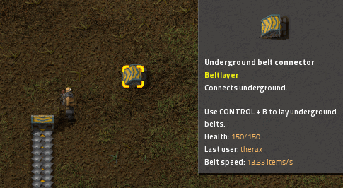
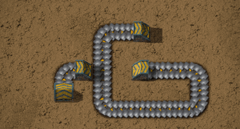

# Description

Ever wanted your underground belts to turn corners?

Ever wanted to run underground belts long distances without periodically popping up above ground?

Ever wondered why underground belts cost the same whether you run them under one tile or their full length?

If the answer to any of these questions is yes, then you need Beltlayer.

# How to use

1. Build some Beltlayer connectors of the desired belt speed. Connectors are researched at the same time as the normal underground belts of the same speed and use the same recipe.

    

1. Place down two connectors, one at the entrance and one at the exit. You can use any rotation for these connectors. Change the connectors between input and output mode with the rotation key (normally R).

    

1. As the description for the connector indicates, press CONTROL+B (rebindable) to show the editor interface. You will see the underground endpoints of the two connectors you placed. The editor interface carries over all passive belt entities (belts and normal underground belts; no splitters or loaders) that were in your inventory.

    

1. Place belts in the glorious freedom of the underground between the two connectors, using the belt mechanics you are already familiar with.

    

1. Press CONTROL + B again to return to your character in the overworld.
1. Profit!

    

# How it works

Each underground belt connector is a pair of loaders, one on the surface and one on the special underground surface. Each loader is connected to an invisible chest. Periodic Lua scripting teleports items from the chest on the surface to the matching chest underground, or vice versa. The mod takes special care to minimize the UPS impact by transferring multiple stacks of items at once, and minimizing the amount of processing required.

# Caveats

1. Items are mixed randomly in the left and right lanes of output belts. This makes Beltlayer only usable with belts carrying the same item in both lanes, or "sushi belt" designs that don't have any item placement requirements. This is a limitation of Factorio's loader entities. This may be possible to change in 0.17 if these feature requests are implemented:
    * https://forums.factorio.com/viewtopic.php?t=61865
    * https://forums.factorio.com/viewtopic.php?t=61442

1. If your belts are not full, you will clearly be able to see the bursts when items are transferred from one surface to the other, with a 50% saturated belt becoming alternately fully saturated and empty.

1. Connectors buffer quite a lot of items to allow multiple stacks to be transferred at once. When running with saturated belts, you will notice some strange gaps in belt flow when these buffers are being filled, but after a few update cycles the flow will stabilize.

1. Mining connectors, or mining belts from the editor interface, puts mined items into your character's inventory. If there is insufficient room, they will be spilled on the ground at your character's feet.

1. Connectors can only be placed on the main overworld map. No, you can't use these in space, Factorissimo buildings, or any other custom surfaces that may be added by other mods.

1. Blueprinting and deconstruction is implemented with Black Magic. There are almost certainly bugs. There are also a huge variety of possible scenarios in which you might encounter problems. Please report *exactly* what you did leading up to a bug, including:
    1. a screenshot showing the precise area selected with the blueprint or deconstruction tool,
    1. a screenshot of the below ground editor matching the above ground screenshot,
    1. the filter settings of the deconstruction tool, if applicable,
    1. a screenshot of the blueprint setup window, if applicable, and
    1. a description of what you expected to happen, and what happened instead.

# Comparison to similar mods

## [Subterrain](https://mods.factorio.com/mod/Subterrain)

* Beltlayer belts can turn corners.
* Beltlayer belts are blueprintable and can be built with construction robots.

## [Subterra](https://mods.factorio.com/mod/subterra)

* Subterra allows players and fluids to be transferred through the ground, as well as items.
* Subterra allows splitters, assemblers, and complete subterranean bases.
* Subterra preserves lane-identity for belts.
* Beltlayer is substantially more UPS-efficient.
* Beltlayer belts are blueprintable and can be built with construction robots.

# FAQ

## What's with the name of the mod?

A pipelayer is a person who installs ("lays down") pipes in underground areas. It is also a reference to the separate underground layer where the belts are routed.

## Isn't this a little bit cheaty?

Yes, it absolutely is! The straight-line and length limitations of standard underground belts are part of Factorio's design challenge. Overuse of this mod may result in an unintended shortage of spaghetti in your factory.

On the other hand, you still have to move items on the surface to split, balance, and route items into and out of assembling machines, so the potentional for abuse is somewhat limited. Using this mod also introduces a new layer of complexity, where keeping track of where items are routed is no longer obvious just from looking at the surface. If you're not careful, you can make your own factory layout very confusing to navigate.